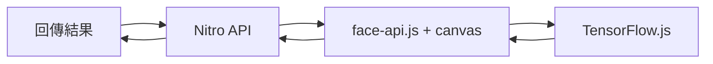
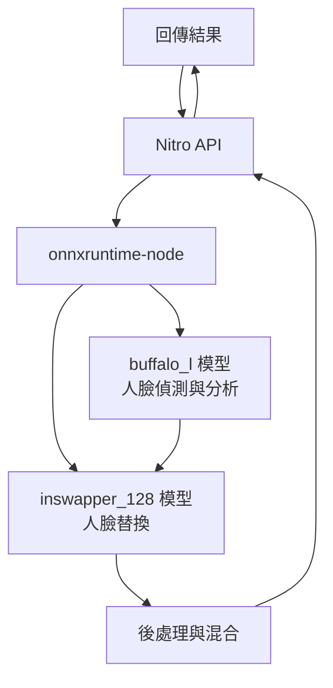

# AI 人臉替換功能實作計劃

將 `face-swap.vue` 改為資料夾結構，提供純前端與後端兩種人臉替換實作版本。

---

## 檔案結構

```
app/pages/face-swap/
├── index.vue      # 導航頁面 ✅
├── frontend.vue   # 純前端版本 ✅
└── backend.vue    # 後端版本 ✅
```

---

## Phase 1: 資料夾結構轉換 ✅

| 檔案           | 狀態    |
| -------------- | ------- |
| `index.vue`    | ✅ 完成 |
| `frontend.vue` | ✅ 完成 |
| `backend.vue`  | ✅ 完成 |

---

## Phase 2: 純前端版本 ✅

使用 `face-api.js` + Canvas 在瀏覽器端實作：

- ✅ 來源臉部圖片上傳
- ✅ 攝影機即時偵測
- ✅ Canvas 臉部替換
- ✅ 結果下載

---

## Phase 3: 後端版本 (基礎實作) ✅

### 架構 v1 (已完成)



### 技術堆疊 v1 (已安裝)

| 項目                    | 版本   | 狀態 |
| ----------------------- | ------ | ---- |
| `face-api.js`           | 0.22.2 | ✅   |
| `@tensorflow/tfjs-node` | 4.22.0 | ✅   |
| `canvas`                | 3.2.0  | ✅   |

### 實作項目 ✅

**已完成檔案：**

- `server/utils/face-swap.js` - 基礎 face swap utility
- `server/api/face-swap/process.post.js` - API endpoint
- `app/pages/face-swap/backend.vue` - 完整 UI

**API 規格 v1：**

```typescript
// POST /api/face-swap/process
Request: FormData {
  sourceImage: File;
  targetImage: File;
}
Response: {
  success: boolean;
  resultImage?: string;  // base64
  error?: string;
}
```

---

## Phase 4: 後端深度優化 (進行中) 🚀

### 目標

使用最先進的 AI 模型取代基礎實作，實現專業級的人臉替換效果。

### 優化方案：InsightFace InSwapper

> [!IMPORTANT]
> **InsightFace InSwapper** 是目前最先進的開源換臉模型之一，廣泛應用於專業換臉應用。

**為什麼升級？**

當前 face-api.js 實作的限制：

- ❌ 品質不足：基於簡單圖像處理
- ❌ 表情不保留：無法保持目標表情與姿態
- ❌ 光照不一致：無法自動匹配光照
- ❌ 邊緣生硬：簡單遮罩導致明顯接縫

**InsightFace InSwapper 優勢：**

- ✅ **高品質輸出**：深度學習模型，效果遠超傳統方法
- ✅ **表情保留**：完美保持目標臉部的表情、角度、姿態
- ✅ **光照一致**：自動匹配光照條件
- ✅ **ONNX 格式**：可直接在 Node.js 中使用 `onnxruntime-node`
- ✅ **快速推理**：優化過的模型，支援實時處理

### 架構 v2 (規劃中)



### 技術堆疊 v2 (待安裝)

| 項目               | 版本    | 用途           | 狀態      |
| ------------------ | ------- | -------------- | --------- |
| `onnxruntime-node` | ^1.17.0 | ONNX 推理引擎  | ⏳ 待安裝 |
| `sharp`            | ^0.33.0 | 高性能圖像處理 | ⏳ 待安裝 |
| `canvas`           | 3.2.0   | 輔助圖像操作   | ✅ 已安裝 |

### 模型檔案 (待下載)

需要下載至 `public/models/insightface/`：

| 模型                 | 用途       | 大小   | 狀態 |
| -------------------- | ---------- | ------ | ---- |
| `det_10g.onnx`       | 人臉偵測   | ~17MB  | ⏳   |
| `w600k_r50.onnx`     | 人臉識別   | ~167MB | ⏳   |
| `2d106det.onnx`      | 關鍵點偵測 | ~5MB   | ⏳   |
| `inswapper_128.onnx` | 人臉替換   | ~554MB | ⏳   |

**下載來源：**

- Buffalo_l: https://github.com/deepinsight/insightface/tree/master/python-package/insightface/model_zoo
- InSwapper: https://huggingface.co/deepinsight/inswapper

### 實作項目

**新增檔案：**

- [ ] `server/utils/face-swap-insightface.js` - InsightFace 處理模組
  - [ ] 模型載入與管理
  - [ ] 人臉偵測與分析
  - [ ] 特徵向量提取
  - [ ] InSwapper 模型推理
  - [ ] 後處理與混合

**更新檔案：**

- [ ] `server/api/face-swap/process.post.js` - 使用新實作
- [ ] `server/utils/face-swap.js` - 標記為 deprecated，保留作為備用

### 處理流程

1. **人臉偵測與分析**（buffalo_l 模型）
   - 偵測來源圖片中的人臉
   - 偵測目標圖片中的人臉
   - 提取臉部特徵向量（512維）
   - 獲取臉部關鍵點與對齊資訊

2. **人臉替換**（inswapper 模型）
   - 輸入：來源臉部特徵向量 + 目標臉部區域
   - 輸出：替換後的臉部
   - 自動處理：表情、光照、角度匹配

3. **後處理與融合**
   - 色彩校正
   - 邊緣羽化
   - 無縫混合至目標圖片

### 實作步驟

#### Phase 4.1: 環境準備

- [ ] 安裝 `onnxruntime-node` 和 `sharp`
- [ ] 下載 InsightFace 模型檔案
- [ ] 建立模型目錄結構 `public/models/insightface/`
- [ ] 測試模型載入

#### Phase 4.2: 核心功能實作

- [ ] 實作人臉偵測與分析（buffalo_l）
- [ ] 實作特徵向量提取
- [ ] 實作 InSwapper 模型推理
- [ ] 整合完整換臉流程

#### Phase 4.3: 後處理優化

- [ ] 實作色彩校正
- [ ] 實作邊緣羽化與混合
- [ ] 優化輸出品質

#### Phase 4.4: 整合與測試

- [ ] 更新 API 端點使用新實作
- [ ] 保留舊版作為備用方案
- [ ] 測試各種場景
- [ ] 性能優化

### 驗證計劃

**測試場景：**

1. 不同膚色
2. 不同光照條件（明亮/昏暗/側光）
3. 不同角度（正面/側面/45度）
4. 不同表情（微笑/嚴肅/張嘴）
5. 不同解析度

**評估指標：**

- 處理時間 < 3秒
- 視覺品質：無明顯接縫
- 表情保留：100%
- 光照一致性：自然
- 成功率 > 95%

### 預期效果

**優化前（face-api.js）：**

- ❌ 邊緣明顯，像「貼紙」
- ❌ 色調不匹配
- ❌ 表情可能變形
- ❌ 光照不協調

**優化後（InsightFace InSwapper）：**

- ✅ 邊緣完全融合，無接縫
- ✅ 色調自動匹配
- ✅ 完美保留目標表情
- ✅ 光照自然一致
- ✅ 專業級換臉品質

---

## 注意事項

> [!WARNING]
> **模型檔案大小**
>
> - InSwapper 模型約 554MB
> - Buffalo_l 模型組約 200MB
> - 總計約 750MB，需確保伺服器有足夠空間
> - Vercel 部署可能受限，建議使用其他平台或 CDN

> [!WARNING]
> **授權與合規**
>
> - InsightFace 模型需遵守其授權條款
> - 商業使用前請確認授權
> - 建議添加使用條款與免責聲明

> [!CAUTION]
> **倫理考量**
>
> - 換臉技術可能被濫用
> - 建議添加浮水印或標記
> - 實作使用記錄與審計機制

> [!TIP]
> **性能優化建議**
>
> - 首次載入模型會較慢（cold start）
> - 考慮使用模型快取
> - 可選擇 inswapper_128（較快）或 inswapper_512（更高品質）
> - 生產環境建議使用 GPU 加速

---

## 備用方案

如果 InsightFace 整合遇到困難：

### 方案 A：Python 微服務

- 使用 Python + InsightFace 建立獨立服務
- Node.js 透過 HTTP 呼叫 Python 服務
- 優點：完整功能，易於實作
- 缺點：需要額外部署

### 方案 B：保留現有實作

- 繼續使用 face-api.js
- 實作進階影像處理優化
- 優點：純 Node.js，無額外依賴
- 缺點：品質無法達到深度學習模型水準

---

## 參考資源

- [InsightFace GitHub](https://github.com/deepinsight/insightface)
- [InsightFace Official Site](https://insightface.ai/)
- [ONNX Runtime Node.js](https://onnxruntime.ai/docs/get-started/with-javascript.html)
- [InSwapper Models on Hugging Face](https://huggingface.co/deepinsight/inswapper)
- [Face-api.js Documentation](https://github.com/justadudewhohacks/face-api.js)
