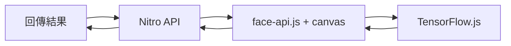

# AI 人臉替換功能實作計劃

將 `face-swap.vue` 改為資料夾結構，提供純前端與後端兩種人臉替換實作版本。

---

## 檔案結構

```
app/pages/face-swap/
├── index.vue      # 導航頁面 ✅
├── frontend.vue   # 純前端版本 ✅
└── backend.vue    # 後端版本 (開發中)
```

---

## Phase 1: 資料夾結構轉換 ✅

| 檔案 | 狀態 |
|-----|------|
| [index.vue](file:///Users/parker/Desktop/code/parker-nuxt-lab/app/pages/face-swap/index.vue) | ✅ 完成 |
| [frontend.vue](file:///Users/parker/Desktop/code/parker-nuxt-lab/app/pages/face-swap/frontend.vue) | ✅ 完成 |
| [backend.vue](file:///Users/parker/Desktop/code/parker-nuxt-lab/app/pages/face-swap/backend.vue) | ✅ 佔位完成 |

---

## Phase 2: 純前端版本 ✅

使用 `face-api.js` + Canvas 在瀏覽器端實作：
- 來源臉部圖片上傳
- 攝影機即時偵測
- Canvas 臉部替換
- 結果下載

---

## Phase 3: 後端版本 (Node.js)

### 架構



### 技術堆疊 (已安裝)

| 項目 | 版本 | 狀態 |
|-----|------|------|
| `face-api.js` | 0.22.2 | ✅ |
| `@tensorflow/tfjs-node` | 4.22.0 | ✅ |
| `canvas` | 3.2.0 | ✅ |

### 實作項目

#### API 端點
- [ ] 建立 `/api/face-swap/process` POST
- [ ] 使用 `node-canvas` 處理圖片
- [ ] 整合 `face-api.js` 人臉偵測

#### 替換邏輯
- [ ] 載入 models from `/public/models`
- [ ] 偵測來源/目標人臉 landmarks
- [ ] Canvas 臉部替換與混合

#### 前端整合
- [ ] 更新 `backend.vue` UI
- [ ] 實作圖片上傳與 API 呼叫
- [ ] 顯示處理結果

### API 規格

```typescript
// POST /api/face-swap/process
Request: {
  sourceImage: string;  // base64
  targetImage: string;  // base64
}
Response: {
  success: boolean;
  resultImage?: string;
  error?: string;
}
```

> [!WARNING]
> **Vercel 部署注意:**
> - 執行時間上限 (Free: 10s, Pro: 60s)
> - Cold start 延遲 (首次載入模型)
> - 建議設定 `maxDuration` 或使用 Edge Functions
